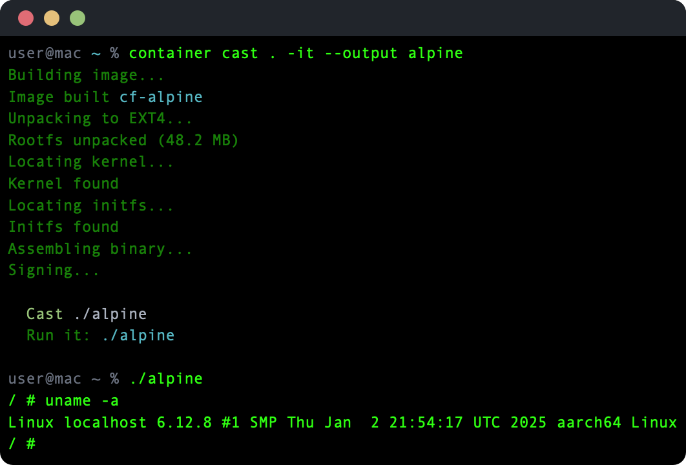

# container cast

A plugin for Apple's [container](https://github.com/apple/container) CLI that casts Containerfiles into self-contained macOS binaries. One executable packages a Linux kernel, filesystem, and runtime config — producing a single portable binary that boots a disposable VM and runs the specified command. Zero footprint when idle.

Built on Apple's native [Containerization](https://github.com/apple/containerization) framework. Each binary spawns its own lightweight VM with full hypervisor isolation — not a shared daemon, not a Docker socket, just a process that starts a VM and exits cleanly.



## Prerequisites

- macOS 26+ (Tahoe)
- Apple Silicon
- [container](https://github.com/apple/container) CLI installed
- Swift 6.0+

## Install

```bash
make build          # Build container-cast + runner
make plugin         # Install as 'container cast' subcommand
```

To install as a standalone binary instead:

```bash
make install        # Install to /usr/local/bin as container-cast
```

## Usage

### Cast a Containerfile

```bash
container cast . --output my-tool
container cast . --image cf-alpine -it --output alpine
container cast . --cpus 4 --memory 1G --output heavy-worker
```

### Run a cast binary

```bash
./my-tool                           # Run default entrypoint
./my-tool /bin/sh                   # Override command
./my-tool -it                       # Interactive TTY session
```

### Inspect a Containerfile

```bash
container cast info .               # Show parsed directives
```

### Cast options

```
--output, -o <path>       Output binary path (default: directory name)
--cpus <int>              CPU cores (default: 2)
--memory <size>           Memory allocation (default: 512M, e.g. "1G", "2048")
--name <string>           Process name in Activity Monitor
--entrypoint <string>     Override image entrypoint
--no-network              Disable networking
-i, --interactive         Keep stdin open
-t, --tty                 Allocate pseudo-terminal
--image <reference>       Use existing image instead of building
```

### Runtime overrides

Cast binaries accept environment variables to override baked-in defaults:

```bash
CAST_CPUS=8 ./my-tool                          # More cores
CAST_MEMORY=2G ./my-tool                       # More memory
CAST_NO_NETWORK=1 ./my-tool                    # Disable networking
CAST_TIMEOUT=300 ./my-tool                     # 5 minute timeout
CAST_MOUNT="/host/src:/guest/src" ./my-tool     # Bind mount
```

## How It Works

1. **Build** — Parses the Containerfile and builds an OCI image via `container build`
2. **Extract** — Pulls the Linux kernel, initfs, and unpacked rootfs (as sparse EXT4)
3. **Assemble** — Packs kernel + initfs + rootfs + metadata into a binary payload, appended to an embedded runner executable
4. **Patch** — Adjusts the Mach-O headers and codesigns with virtualization entitlements
5. **Run** — At execution time, the embedded runner extracts the payload (cached by SHA256), boots a VM via the Containerization framework, and streams I/O

The payload format uses sparse EXT4 compression — only non-zero blocks are stored, typically achieving ~4x compression on filesystem images.

## Project Structure

```
Sources/
├── container-cast/          # CLI tool
│   ├── Cast/                # Build, extract, assemble, patch, codesign
│   ├── Info/                # Containerfile parser and inspector
│   └── Completions/         # zsh completion generation
└── container-cast-runner/   # Embedded in output binaries
    ├── PayloadExtractor/    # Reads binary trailer, extracts and caches payload
    └── VMBoot/              # Boots VM via Containerization framework
```

## License

MIT
